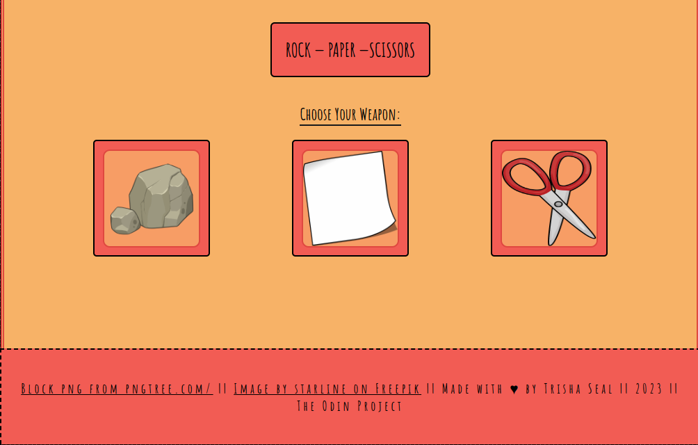

# Rock-Paper-Scissors

Table of Contents

1. [About The Project](#about-the-project) 
2. [Built With](#built-with)  
3. [Screenshots](#screenshots)  
3. [Contact](#contact)  
4. [Acknowledgements](#acknowledgements)

## About The Project

Bringing back your favourite childhood game with a playful UI.

### How to Play:

Click on your weapon of choice. The one with maximum score over a game of 5 rounds wins.

### Built With:

 

<a href="#top">Back to top</a>

## Screenshots

<a href="#top">Back to top</a>

### Future Plans

- Keyboard controls.
- Sound effects.

## Contact

LinkedIn: [Trisha Seal](https://linkedin.com/in/trisha-seal)  
GitHub: [@EmberTSeal](https://github.com/EmberTSeal)

## Acknowledgements

Design and development by me, developed as part of The Odin Project, 2023.
Images from Freepik and pngtree.

<a href="#top">Back to top</a>

